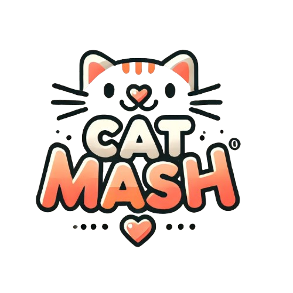

<p align="center">
    
</p>

## Description

Back Api of Cat Mash application based on [Nest](https://github.com/nestjs/nest) framework TypeScript starter repository.

## Project setup

### Configuration
the configuration is set with an environment file here.
you have to create a ".env" file that respect the ".env.example" file set as an example and complete the values for your environment.

### Install dependencies

```bash
$ npm install
```

## Compile and run the project

```bash
# development
$ npm run start

# watch mode
$ npm run start:dev

# production mode
$ npm run start:prod
```


## Build

I use docker to manage applications, so I build with it

```bash
docker build --build-arg PORT=3000 .
```


## Resources

Check out a few resources that may come in handy when working with NestJS:

- Visit the [NestJS Documentation](https://docs.nestjs.com) to learn more about the framework.

